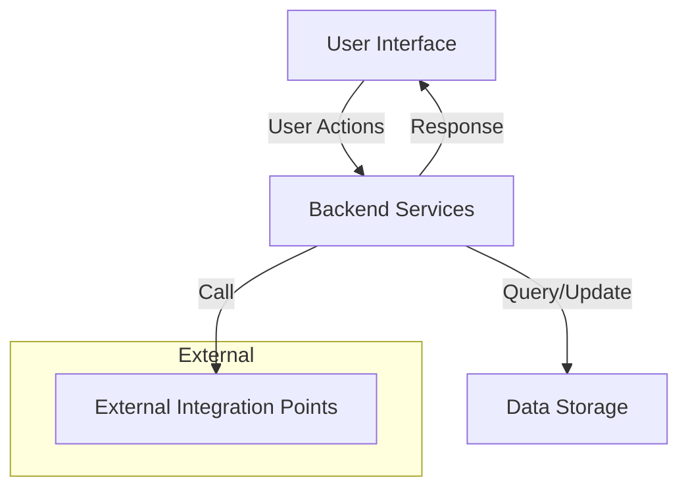

## System Architecture Overview

Understanding how the main parts of a system click together can feel like seeing the whole puzzle at once. This page lays out a clear, high-level picture of how the key components interact, which paths data and user actions take, and where integrations hook in. Getting this overview means you can better navigate the details later without getting lost.

### What This Page Covers and Who It’s For
This overview breaks down the system into its major building blocks and shows how they communicate so you can grasp the flow and dependencies of the product with ease. Whether you’re a developer preparing to extend the system, an architect planning integrations, or simply someone curious how everything fits together, this page speaks your language.

### Core Structure and Data Flow
At its heart, the system connects several primary components: the User Interface, Backend Services, Data Storage, and Integration Points. Users interact mainly through the UI, which sends requests to backend services responsible for processing logic and orchestrating data retrieval or updates. These backend services access one or more databases where persistent data lives.

To visualize this clearly:



This simple but effective chain helps you understand the core workflow––from a user clicking a button to data being fetched or changed and reflected back in the UI. Importantly, integrations outside the system (like third-party APIs or plugins) connect here, enabling the system to extend functionality beyond its core.

### How the System “Actually Works” in Real Terms
Imagine you are using the system to fetch a user profile and update certain preferences. When the UI receives your input, it forwards it to backend services, which validate the request and fetch the profile from the database. Upon updating preferences, the backend may notify an external service to sync data across platforms. Finally, the UI updates to reflect the changes.

Behind this seemingly simple flow are checks and balances that ensure data integrity, smooth user experience, and extensibility, letting you plug in additional modules without disrupting the whole system.

Here’s a brief illustration of a typical request-response flow:

```plaintext
User clicks "Update Preferences" --> UI sends request
                   --> Backend validates and updates database
                   --> Backend triggers integration sync
                   --> Backend sends confirmation response
                   --> UI updates display to show new preferences
```

### Practical Benefits of Understanding This Architecture
Knowing this layout helps you troubleshoot effectively: for example, if data isn’t updating in the UI, you can determine whether to check the backend service or integration points. It also aids in planning custom features—whether you need to extend the backend, add new database tables, or hook additional APIs.

Since the architecture cleanly separates concerns, each part can evolve or be replaced independently, minimizing risk and downtime.

### Getting Started From Here
To dive deeper, check out the [Core Concepts & Terminology](/overview/architecture-and-core-concepts/core-concepts) page to understand key terms used in this diagram and how specifics like data models come into play. Also, the [Quick Feature Overview](/overview/features-overview/quick-feature-tour) shows how features map onto this architecture in real user scenarios.

If you’re ready to see this in action, start with the [Getting Started Guide](/getting-started) to set up your environment and interact with the system hands-on.

<Source url="https://github.com/modelorona/whodb" branch="main" paths={[{"path": "docs/architecture/system_architecture_overview.md", "range": "1-50"}]} />
