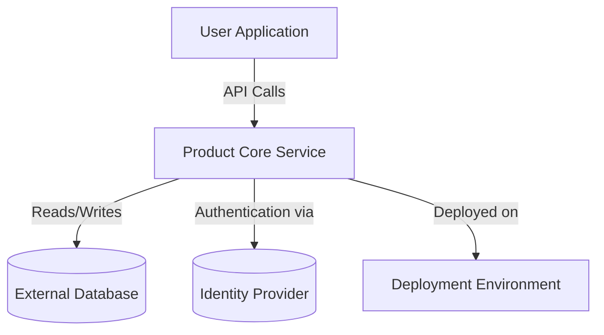

## How Integration Shapes Your Workflow

When you’re adopting a new tool, one big question is always: how will it fit with what you already use? This page shines a light on how the product connects with other systems, highlighting common external dependencies and typical ways you might deploy or interact with it. Understanding this helps you see how easy (or not) your adoption journey will be and how the product can work within your existing ecosystem.

## What Integration Means Here and Who Benefits Most

This page covers how the product integrates with common third-party services, databases, and deployment platforms, plus typical usage scenarios. Whether you’re a systems architect planning a rollout, a DevOps engineer setting up CI/CD pipelines, or a developer wanting to understand how this product fits into your toolchain, this page is your go-to resource for practical implementation insights.

## Integration Architecture at a Glance

At its core, the product acts as a modular system designed to plug easily into standard environments without demanding radical changes. It usually interfaces with:

- External data sources or databases for loading and storing data.
- Common identity providers or authentication systems for secure access.
- Hosting and deployment environments that support containerization or cloud-native applications.

The architecture favors loosely coupled integrations to support flexibility and scalability. Here’s a simplified flow showing these interactions:



This shows how you can slot the product within existing infrastructure, communicating through clear, standard interfaces.

## Real-World Deployment and Ecosystem Scenarios

Imagine you’re rolling this product out in your company. Typically, you’ll:

- Deploy it inside a containerized environment like Docker or Kubernetes, fitting into your orchestrated infrastructure.
- Connect it to your existing user directory via supported authentication protocols, so users get seamless access without managing new credentials.
- Link the product to your primary database for centralized data management, ensuring all your tools work with consistent information.

For example, if your team already uses OAuth 2.0 with an identity service such as Auth0, the product can integrate with that provider to handle login flows. This avoids creating separate authentication systems and leverages your current security policies.

Here’s a quick snippet of configuration you might use to set up authentication:

```yaml
authentication:
  provider: "auth0"
  clientId: "YOUR_CLIENT_ID"
  domain: "YOUR_DOMAIN"
  redirectUri: "https://yourapp.example.com/callback"
```

By plugging into these standards, the product works smoothly alongside your existing tools, reducing friction and simplifying operations.

## Tips for a Smooth Integration

Successful integration isn’t just about connecting systems but how to do it effectively. Keep these in mind:

- Verify compatibility with your database version and authentication protocols early to avoid blockers.
- Use containerization as a best practice for consistent deployments across environments.
- Monitor API usage and latency if the product communicates frequently with external services.
- Plan for secure handling of credentials and secrets, ideally managed by your environment’s secrets manager.

<Tip>
Don’t underestimate the value of starting with a staging environment mirroring your production setup. This helps catch integration hiccups early before impacting users.
</Tip>

## Next Steps: Dive Deeper and Get Started

Now that you know how the product fits into your ecosystem, you can move on to setting it up. Check out the [Getting Started guide](/overview/features-overview/quick-feature-tour) for hands-on instructions and examples that will get you running fast.

For a deeper understanding of the underlying architecture and design principles, see the [System Architecture Overview](/overview/architecture-and-core-concepts/architecture-diagram).

<Source url="https://github.com/modelorona/whodb" branch="main" paths={[{"path": "docs/overview/features-overview/integration-overview.md", "range": "1-80"}]} />